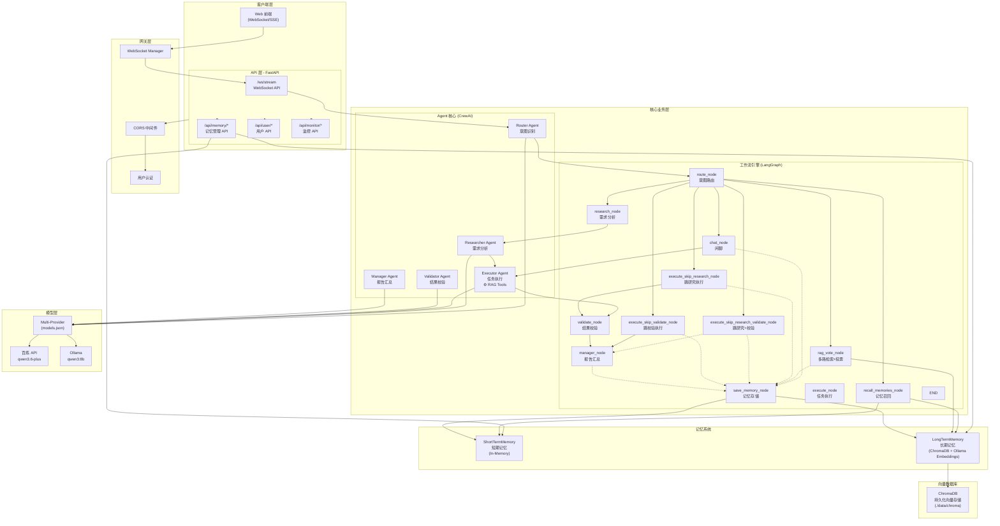

# AI Agent 平台

基于 CrewAI + LangGraph 的企业级多 Agent 协作平台

## 系统架构图



## 技术架构分层

```
┌─────────────────────────────────────────────────────────────────────────────┐
│                              客户端层 (Client)                               │
│                    Web 前端 (WebSocket/SSE) · HTTP API                       │
├─────────────────────────────────────────────────────────────────────────────┤
│                              网关层 (Gateway)                                │
│                  WebSocket Manager · CORS · 用户认证中间件                   │
├─────────────────────────────────────────────────────────────────────────────┤
│                              API 层 (FastAPI)                                │
│         WebSocket API · 记忆管理 API · 用户 API · 监控 API                   │
├─────────────────────────────────────────────────────────────────────────────┤
│                            Agent 核心层 (CrewAI)                              │
│  ┌─────────┐ ┌─────────────┐ ┌───────────┐ ┌───────────┐ ┌─────────────┐    │
│  │ Router  │ │ Researcher  │ │ Executor  │ │ Validator │ │  Manager   │    │
│  │ 意图识别 │ │  需求分析   │ │ 任务执行  │ │ 结果校验  │ │  报告汇总   │    │
│  └────┬────┘ └──────┬─────┘ └─────┬─────┘ └─────┬─────┘ └─────┬─────┘    │
│       └──────────────┴─────────────┴──────────────┴──────────────┘          │
│                            ⚙️ RAG Tools (知识库检索)                          │
├─────────────────────────────────────────────────────────────────────────────┤
│                          工作流层 (LangGraph)                                 │
│  recall → route → [chat|rag_vote|research|execute] → validate → manager   │
├─────────────────────────────────────────────────────────────────────────────┤
│                            记忆层 (Memory)                                   │
│  ┌──────────────────────┐      ┌──────────────────────────────────────┐    │
│  │   ShortTermMemory    │      │         LongTermMemory              │    │
│  │    (会话级缓存)       │      │   (ChromaDB + Ollama Embeddings)    │    │
│  └──────────────────────┘      └──────────────────────────────────────┘    │
├─────────────────────────────────────────────────────────────────────────────┤
│                            模型层 (Multi-Provider)                           │
│              ┌─────────────────┐         ┌─────────────────┐                │
│              │   百炼 API      │         │    Ollama       │                │
│              │  qwen3.6-plus  │         │   qwen3:8b      │                │
│              └─────────────────┘         └─────────────────┘                │
└─────────────────────────────────────────────────────────────────────────────┘
```

## 核心组件技术栈

| 层级 | 组件 | 技术选型 | 说明 |
|------|------|---------|------|
| **Web 框架** | FastAPI + Uvicorn | 异步 API + ASGI | 高性能 Web 服务，支持 async/await |
| **Agent 框架** | CrewAI | 多 Agent 协作 | 5 个角色 Agent (Router/Researcher/Executor/Validator/Manager) |
| **工作流引擎** | LangGraph | 状态机 + 有向图 | 12 个节点，支持条件路由与并行执行 |
| **LLM 集成** | LangChain + LiteLLM | 多 Provider | 百炼(qwen)、Ollama 本地模型统一接口 |
| **向量存储** | ChromaDB | 本地向量数据库 | 持久化存储于 `./data/chroma` |
| **嵌入模型** | Ollama Embeddings | nomic-embed-text | 文本向量化，支持语义检索 |
| **RAG 工具** | CrewAI Tools + LangChain | 结构化工具 | search_knowledge_base / search_user_memory |
| **实时通信** | WebSocket + SSE | 流式输出 | 实时推送 Agent 执行进度 |
| **数据验证** | Pydantic v2 | 类型约束 | 请求/响应校验，自动生成 OpenAPI 文档 |
| **日志系统** | Loguru | 结构化日志 | 统一日志格式，支持多输出目标 |
| **任务队列** | asyncio.Queue | 内存队列 | 异步任务调度与并发控制 |

## 项目架构

```
ai_agent_platform/
├── app/                          # 应用核心代码
│   ├── __init__.py
│   ├── main.py                   # FastAPI 应用入口
│   ├── settings.py               # 配置管理 (Provider 切换)
│   ├── agent/                    # Agent 核心模块
│   │   ├── agents.py            # CrewAI Agent 定义 + RAG Tools
│   │   ├── tasks.py             # TaskFactory + 任务配置 + Prompt 加载
│   │   └── streaming_workflow.py # LangGraph 工作流编排 (12 个节点)
│   ├── api/                      # API 路由层
│   │   ├── websocket_api.py     # WebSocket 实时通信
│   │   ├── memory_api.py        # 记忆管理 API (CRUD)
│   │   ├── user_api.py         # 用户认证 API
│   │   └── monitor_api.py       # 系统监控 API
│   ├── core/                     # 核心业务模块
│   │   ├── memory.py            # 记忆系统 (ShortTermMemory + LongTermMemory)
│   │   ├── rag_tools.py         # RAG 工具 (search_knowledge_base)
│   │   ├── user_system.py       # 用户权限系统
│   │   ├── task_queue.py        # 异步任务队列
│   │   └── websocket_manager.py # WebSocket 连接管理
│   ├── llm/                      # LLM 配置层
│   │   └── model_factory.py     # 模型工厂 (ChatOpenAI/LiteLLM/Ollama)
│   ├── schemas/                  # Pydantic 数据模型
│   ├── data/                     # 数据存储
│   │   └── chroma/              # ChromaDB 向量数据库文件
│   └── static/                   # 静态资源
│       └── js/app.js            # 前端 JavaScript
├── config/                       # 配置文件
│   ├── agents.yaml              # Agent 角色定义 (5 个角色)
│   ├── tasks.yaml               # 任务配置 (5 种任务类型)
│   └── prompts.yaml             # Prompt 模板
├── models.json                   # 多 Provider 模型配置
├── requirements.txt              # Python 依赖
├── README.md                      # 项目文档
└── AGENTS.md                     # Agent 配置文件
```

## LangGraph 工作流详解

```
┌──────────────────────────────────────────────────────────────────────────────────────────────┐
│                                    LangGraph 工作流图                                         │
│                                                                                              │
│  ┌─────────┐      ┌─────────────────────────────────────────────────────────────────┐        │
│  │  START  │─────▶│                        recall_memories_node                     │        │
│  └─────────┘      │  • 召回短期记忆 (会话上下文)                                          │        │
│                   │  • 召回长期记忆 (ChromaDB RAG)                                       │        │
│                   └──────────────────────────┬──────────────────────────────────────────┘        │
│                                              │                                                   │
│                                              ▼                                                   │
│                   ┌─────────────────────────────────────────────────────────────────┐        │
│                   │                         route_node                             │        │
│                   │  • 分析用户意图，判断 task_type                                      │        │
│                   │  • chat / simple / complex / question                            │        │
│                   └──────────────────────────┬──────────────────────────────────────────┘        │
│                                              │                                                   │
│        ┌─────────────┬─────────────┬─────────┼─────────┬─────────────┬─────────────┐           │
│        │             │             │         │         │             │             │           │
│        ▼             ▼             │         ▼         │             │             │           │
│  ┌───────────┐ ┌───────────┐       │  ┌─────────────┐  │             │             │           │
│  │    chat   │ │ rag_vote  │       │  │  simple     │  │             │             │           │
│  │  task_type│ │ task_type │       │  │  skip_rs=Y  │  │             │             │           │
│  │  =chat    │ │ =question │       │  │             │  │             │             │           │
│  └─────┬─────┘ └─────┬─────┘       │  └──────┬──────┘  │             │             │           │
│        │             │             │         │         │             │             │           │
│        │             │             │         │         │             │             │           │
│        │             │             │         ▼         │             │             │           │
│        │             │             │  ┌─────────────────────┐  │             │             │           │
│        │             │             │  │ execute_skip_       │  │             │             │           │
│        │             │             │  │ research_node      │  │             │             │           │
│        │             │             │  │ 跳过研究阶段        │  │             │             │           │
│        │             │             │  └─────────┬───────────┘  │             │             │           │
│        │             │             │            │              │             │             │           │
│        │             │             │     ┌──────┴──────┐       │             │             │           │
│        │             │             │     ▼             ▼       │             │             │           │
│        │             │             │  skip_validate=Y    skip_validate=N  │             │           │
│        │             │             │     │             │       │             │             │           │
│        │             │             │     ▼             ▼       │             │             │           │
│        │             │             │  ┌────────────┐  ┌──────────────┐  │             │           │
│        │             │             │  │execute_skip│  │ execute_skip │  │             │           │
│        │             │             │  │_rs_val_node│  │ _rs_node     │  │             │           │
│        │             │             │  └─────┬──────┘  └──────┬───────┘  │             │           │
│        │             │             │        │              │          │             │           │
│        │             │             │        │              ▼          │             │           │
│        │             │             │        │      ┌─────────────┐    │             │           │
│        │             │             │        │      │   validate   │    │             │           │
│        │             │             │        │      └──────┬──────┘    │             │           │
│        │             │             │        │             │           │             │           │
│        │             │             │        └─────────────┴───────────┘           │             │
│        │             │             │                      │                      │             │
│        │             │             │         ┌────────────┼────────────┐          │             │
│        │             │             │         │            │            │          │             │
│        │             │             │         ▼            │            │          │             │
│        │             │             │  ┌────────────┐       │            │          │             │
│        │             │             │  │simple skip │       │            │          │             │
│        │             │             │  │  _val_node │       │            │          │             │
│        │             │             │  └─────┬──────┘       │            │          │             │
│        │             │             │        │              │            │          │             │
│        │             │             │        └───────────────┼────────────┘          │             │
│        │             │             │                        │                      │             │
│        │             │             │                        ▼                      │             │
│        │             │             │               ┌───────────────┐                │             │
│        │             │             │               │    manager    │                │             │
│        │             │             │               │   (报告汇总)   │                │             │
│        │             │             │               └───────┬───────┘                │             │
│        │             │             │                       │                      │             │
│        │             │             │                       ▼                      │             │
│        │             │             │              ┌────────────────┐                │             │
│        │             │             │              │ save_memory    │                │             │
│        │             │             │              │ • 短期记忆      │                │             │
│        │             │             │              │ • 长期记忆(RAG)│                │             │
│        │             │             │              └───────┬────────┘                │             │
│        │             │             │                      │                       │             │
│        │             │             │                      ▼                       │             │
│        │             │             │                    ┌────┐                     │             │
│        │             │             │                    │END │                     │             │
│        │             │             │                    └────┘                     │             │
│        │             │             │                       ▲                      │             │
│        │             │             │                       │                       │             │
│        │             │             │         ┌─────────────┴─────────────┐          │             │
│        │             │             │         │                           │          │             │
│        │             │             │         ▼                           │          │             │
│        │             │             │  ┌─────────────────┐                │          │             │
│        │             │             │  │   complex       │                │          │             │
│        │             │             │  │   skip_rs=N     │                │          │             │
│        │             │             │  └────────┬────────┘                │          │             │
│        │             │             │           │                        │          │             │
│        │             │             │           ▼                        │          │             │
│        │             │             │   ┌───────────────┐                  │          │             │
│        │             │             │   │   research    │                  │          │             │
│        │             │             │   │  (需求分析)    │                  │          │             │
│        │             │             │   └───────┬───────┘                  │          │             │
│        │             │             │           │                          │          │             │
│        │             │             │           ▼                          │          │             │
│        │             │             │   ┌───────────────┐                  │          │             │
│        │             │             │   │   execute     │                  │          │             │
│        │             │             │   │  (任务执行)    │                  │          │             │
│        │             │             │   └───────┬───────┘                  │          │             │
│        │             │             │           │                          │          │             │
│        │             │             │     ┌─────┴─────┐                     │          │             │
│        │             │             │     ▼           ▼                     │          │             │
│        │             │             │  skip_validate=Y              skip_validate=N    │             │
│        │             │             │     │           │                     │          │             │
│        │             │             │     │           ▼                     │          │             │
│        │             │             │     │    ┌─────────────┐               │          │             │
│        │             │             │     │    │  validate   │               │          │             │
│        │             │             │     │    │  (结果校验)  │               │          │             │
│        │             │             │     │    └──────┬──────┘               │          │             │
│        │             │             │     │           │                      │          │             │
│        │             │             │     └───────────┴──────────────────────┘          │             │
│        │             │             │                       ▲                          │             │
│        │             │             │                       │                          │             │
│        │             │             │                       │                          │             │
│        └─────────────┴─────────────┴───────────────────────┴──────────────────────────────┘             │
└──────────────────────────────────────────────────────────────────────────────────────────────┘
```

### 边关系表

| 源节点 | 目标节点 | 条件/类型 |
|--------|----------|----------|
| START | recall | 普通边 |
| recall | route | 普通边 |
| route | chat | `task_type == "chat"` |
| route | rag_vote | `task_type == "question"` |
| route | execute_skip_research | `task_type == "simple/complex" && skip_research == true` |
| route | execute_skip_validate | `task_type == "simple/complex" && skip_research == true && skip_validate == true` |
| route | research | `task_type == "complex" && skip_research == false` |
| rag_vote | save_memory | 普通边 |
| research | execute | 普通边 |
| execute | validate | `skip_validate == false` |
| execute | manager | `skip_validate == true` |
| validate | manager | 普通边 |
| manager | save_memory | 普通边 |
| save_memory | END | 普通边 |

## 节点说明

| 节点 | Agent | 功能 | 技术选型 |
|------|-------|------|----------|
| recall_memories_node | - | 召回短期/长期记忆 | ChromaDB + In-Memory |
| route_node | - | 意图识别，判断task_type | CrewAI Router |
| chat_node | executor | 闲聊回复 | CrewAI Executor |
| rag_vote_node | executor | 多路检索+LLM投票 | RAG搜索 + 网络搜索 + LLM投票 |
| research_node | researcher | 需求分析 | CrewAI Researcher + RAG Tools |
| execute_node | executor | 任务执行 | CrewAI Executor + RAG Tools |
| execute_skip_research_node | executor | 跳过研究直接执行 | CrewAI Executor + RAG Tools |
| execute_skip_validate_node | executor | 跳过校验执行 | CrewAI Executor |
| execute_skip_research_validate_node | executor | 跳研究+校验直接出报告 | CrewAI Executor |
| validate_node | validator | 结果校验 | CrewAI Validator |
| manager_node | manager | 报告汇总 | CrewAI Manager |
| save_memory_node | - | 保存短期/长期记忆 | ChromaDB + In-Memory |

## 记忆系统

- **ShortTermMemory**: 短期会话记忆，自动管理上下文窗口
- **LongTermMemory**: 长期记忆，基于 ChromaDB 向量存储
- **上下文压缩**: Token > 500 时触发压缩

## 多路检索 + 投票机制

当 `task_type == "question"`（问答类）时，系统采用多路检索+投票机制选择最优答案。

### 工作原理

```
                    用户问题
                        │
                        ▼
        ┌───────────────┼───────────────┐
        ▼               ▼               ▼
   ┌─────────┐    ┌─────────┐    ┌─────────┐
   │  RAG    │    │  Web    │    │ Direct  │
   │ 检索    │    │ 搜索    │    │  回答   │
   └────┬────┘    └────┬────┘    └────┬────┘
        │               │               │
        ▼               ▼               ▼
   知识库检索       网络搜索          LLM直接
   (ChromaDB)     (executor)        回答
        │               │               │
        └───────────────┼───────────────┘
                        ▼
            ┌─────────────────────┐
            │    LLM 投票器       │
            │ 评估准确性/相关性/   │
            │ 完整性              │
            └──────────┬──────────┘
                       │
                       ▼
              输出 JSON 投票结果
                       │
                       ▼
               返回最优答案
```

### 三路检索

| 路径 | 数据来源 | 说明 |
|------|---------|------|
| **RAG** | ChromaDB 向量数据库 | 检索本地知识库，基于语义相似度匹配 |
| **Web** | executor agent | 调用网络搜索工具获取外部信息 |
| **Direct** | executor agent | LLM 基于自身知识直接回答 |

### 投票规则

**评估维度**：
1. **准确性** - 答案是否正确、可靠
2. **相关性** - 是否针对用户问题
3. **完整性** - 是否回答完整、有无遗漏

**投票 Prompt**：
```
请从准确性、相关性、完整性三个维度评估每个方案，然后投票选择最优方案。
返回格式：
{
  "winner": "rag" | "web" | "direct",
  "reason": "选择理由",
  "confidence": 0.0-1.0
}
```

**默认规则**：
- 投票失败时，默认选择 `"rag"`（知识库优先）
- 知识库通常包含企业权威数据，优先级最高

### 触发条件

| task_type | 触发流程 | 说明 |
|-----------|---------|------|
| `question` | 多路检索 + 投票 | 问答类、查询类任务 |
| 其他 | 常规工作流 | 闲聊/简单任务/复杂任务 |

## 模型配置

支持多 Provider 切换，通过 `models.json` 配置：

```json
{
  "ALIYUN_BAILIAN": {
    "model": "qwen3.6-plus",
    "base_url": "https://dashscope.aliyuncs.com/compatible-mode/v1"
  },
  "OLLAMA": {
    "model": "qwen3:8b",
    "base_url": "http://localhost:11434/v1"
  }
}
```

修改 `settings.py` 中的 `ACTIVE_PROVIDER` 切换模型。

## 技术栈

### 后端框架
- **FastAPI** - 现代 Python Web 框架
- **Uvicorn** - ASGI 服务器

### AI 框架
- **CrewAI** - 多 Agent 协作框架
- **LangGraph** - 工作流编排与状态管理
- **LangChain** - LLM 应用开发框架

### LLM 集成
- **百炼 (DashScope)** - 阿里云 Qwen 系列模型
- **Ollama** - 本地 LLM 推理
- **LangChain Ollama** - 本地模型适配

### 数据存储
- **ChromaDB** - 向量数据库 (RAG 长期记忆)
- **In-memory** - 短期会话记忆

### 实时通信
- **WebSocket** - 实时流式输出
- **SSE** - 服务端推送

### 辅助工具
- **Pydantic** - 数据验证
- **python-dotenv** - 环境变量管理
- **Loguru** - 日志管理

## 启动

```bash
# 激活虚拟环境
source .venv/bin/activate

# 启动服务
python -m app.main
```

访问 http://127.0.0.1:8718

---

## 设计思路与问题解决

### 一、核心设计思路

#### 1. Agent 分层架构

```python
# app/agent/agents.py - Agent 定义
router      → 意图识别，判断任务类型
researcher → 需求分析，生成执行方案
executor   → 任务执行，产出最终结果
validator  → 结果校验，确保质量
manager    → 报告汇总，整合输出
```

**设计理由**：
- 每个 Agent 单一职责，降低复杂度
- 通过 LangGraph 的条件路由动态组合
- 支持跳过某些阶段（skip_research/skip_validate）提升效率

#### 2. Prompt 与任务配置分离

```yaml
# app/config/prompts.yaml - Prompt 模板
prompts:
  route: |      # 路由 Prompt
    用户输入：{task}
    ...
  research: |
    {short_term_context}
    {related_memories}
    用户需求：{task}
```

```yaml
# app/config/tasks.yaml - 任务配置
tasks:
  research_task:
    agent: researcher
    prompt_key: research
```

**设计理由**：
- Prompt 作为字符串模板，通过 `format()` 动态注入上下文
- Task 配置映射 Agent 和 Prompt，便于管理
- 不修改代码即可调整 Prompt

---

### 二、遇到的问题与解决方案

#### 问题 1：LLM 输出 JSON 解析失败

**现象**：Router Agent 返回的 JSON 格式不标准，包含噪点字符。

**解决**：正则表达式提取 + 多键名兼容

```python
# app/agent/streaming_workflow.py:68-114
def _parse_route_decision(self, raw_output: str) -> RouteDecision:
    # 1. 正则提取 JSON
    json_match = re.search(r'\{[^{}]*(?:\{[^{}]*\}[^{}]*)*\}', raw_output, re.DOTALL)
    if json_match:
        decision = json.loads(json_match.group())
    
    # 2. 多键名兼容（中文/英文）
    key_map = {
        "task_type": ["task_type", "task_类型", "类型"],
        "need_memory": ["need_memory", "需要内存", "需要记忆"],
    }
```

#### 问题 2：CrewAI 流式输出无法捕获

**现象**：Crew 的 `kickoff()` 是同步阻塞调用，无法获取流式 token。

**解决**：重定向 stdout + asyncio 异步执行

```python
# app/agent/streaming_workflow.py:210-245
class StreamBuffer:
    def write(self, text):
        if text.strip():
            asyncio.create_task(self.send_func(self.tid, "thinking", self.agent, {
                "content": text,
                "streaming": True
            }))

# 使用
stream = StreamBuffer(self.send_func, task_id, agent_name)
old_stdout = sys.stdout
sys.stdout = stream
result = crew.kickoff()
sys.stdout = old_stdout
```

#### 问题 3：Ollama 异步调用兼容

**现象**：Ollama 的 API 接口与 OpenAI 兼容模式不同，直接调用会报错。

**解决**：根据 Provider 动态选择调用方式

```python
# app/agent/streaming_workflow.py:157-173
if settings.ACTIVE_PROVIDER == "OLLAMA":
    from langchain_core.messages import HumanMessage
    response = await loop.run_in_executor(
        None,
        lambda: llm.invoke([HumanMessage(content=route_prompt)])
    )
else:
    response = await loop.run_in_executor(
        None,
        lambda: llm.call(route_prompt)
    )
```

#### 问题 4：短期记忆无限膨胀

**现象**：会话上下文持续增长，超出 LLM 上下文窗口。

**解决**：Token 阈值触发压缩

```python
# app/agent/streaming_workflow.py:404-406
token_count = short_term_memory.get_token_count(session_id)
if token_count > 500:
    short_term_memory.compress_context(session_id, compress_threshold=15)
```

```python
# app/core/memory.py:49-54
def compress_context(self, session_id: str, compress_threshold: int = 15):
    messages = self.history[session_id]
    if len(messages) > compress_threshold:
        keep = messages[-compress_threshold:]
        self.history[session_id] = keep
```

#### 问题 5：多 Provider 切换

**现象**：不同 Provider（阿里云百炼 / Ollama）的 API 接口不同。

**解决**：统一适配层 + 模型工厂

```python
# app/llm/model_factory.py:34-56
class ModelFactory:
    @staticmethod
    def get_llm(temperature: float = None):
        if provider == "OLLAMA":
            return ChatOllama(
                model=config["model"],
                base_url=config["base_url"],
                ...
            )
        else:
            return CrewAILLM(
                model=model_name,
                base_url=config["base_url"],
                provider="litellm"
            )
```

#### 问题 6：任务路由决策不准确

**现象**：简单任务被路由到复杂流程，导致响应慢。

**解决**：Router Prompt 引导 + 决策参数精细化

```yaml
# app/config/prompts.yaml
route: |
  【重要】
  - chat: 闲聊、问候（skip_research=true, skip_validate=true）
  - simple: 简单任务（skip_research可配置）
  - complex: 复杂任务（完整流程）
  - question: 问答类（多路检索）
```

---

### 三、关键设计亮点

| 特性 | 实现方式 | 收益 |
|------|---------|------|
| **智能路由** | Router Agent 判断 task_type | 减少不必要流程，提升响应速度 |
| **多路检索+投票** | RAG + Web + Direct 三路并行 | 问答类问题准确率提升 |
| **记忆系统** | ShortTermMemory + LongTermMemory | 上下文连贯性 |
| **流式输出** | Stdout 重定向 + WebSocket | 实时展示执行进度 |
| **条件边** | LangGraph add_conditional_edges | 灵活的工作流分支 |
| **多 Provider** | LiteLLM 统一接口 | 自由切换模型 |

---

### 四、代码架构图

```
app/agent/
├── agents.py          # Agent 定义 + RAG Tools
├── tasks.py         # TaskFactory + Prompt 加载
└── streaming_workflow.py  # LangGraph 工作流 (12 节点)

app/core/
├── memory.py        # ShortTermMemory + LongTermMemory
└── rag_tools.py   # RAG 工具

app/llm/
└── model_factory.py  # 模型工厂

app/config/
├── agents.yaml     # Agent 角色配置
├── tasks.yaml     # 任务配置
└── prompts.yaml  # Prompt 模板
```

---

### 五、后续优化方向

1. **Agent 并行执行**：research + execute 可并行，减少总耗时
2. **缓存机制**：重复任务结果缓存，避免重复执行
3. **监控指标**：任务耗时、成功率等 metrics 采集
4. **多模态支持**：扩展 RAG 工具支持图片、文件