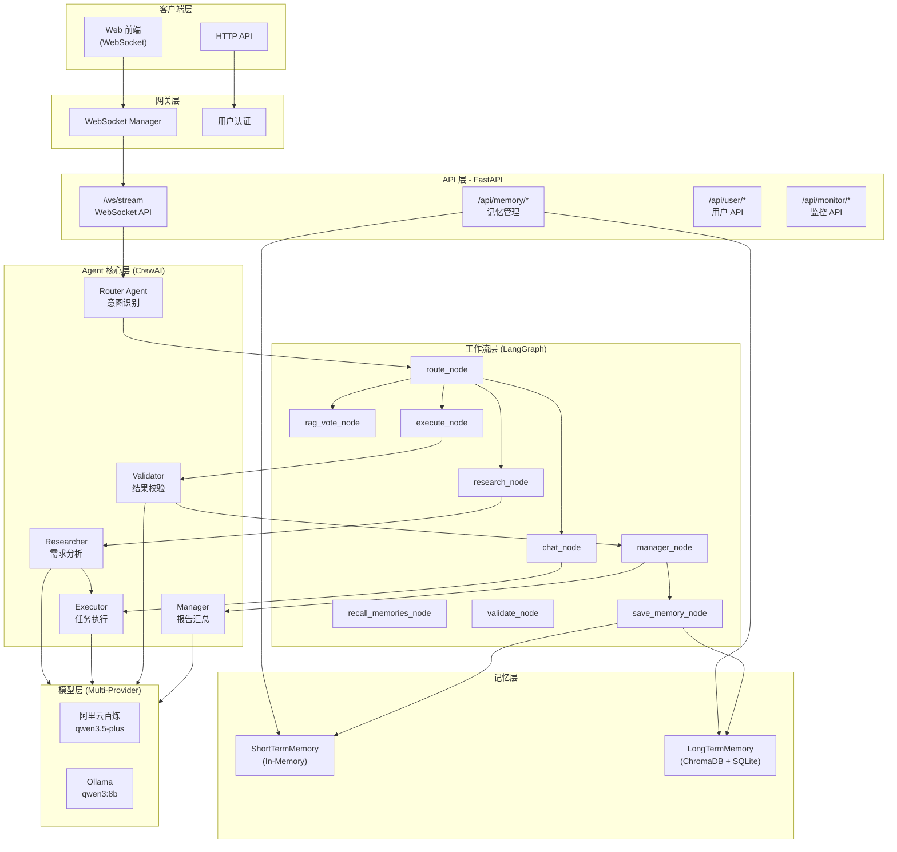
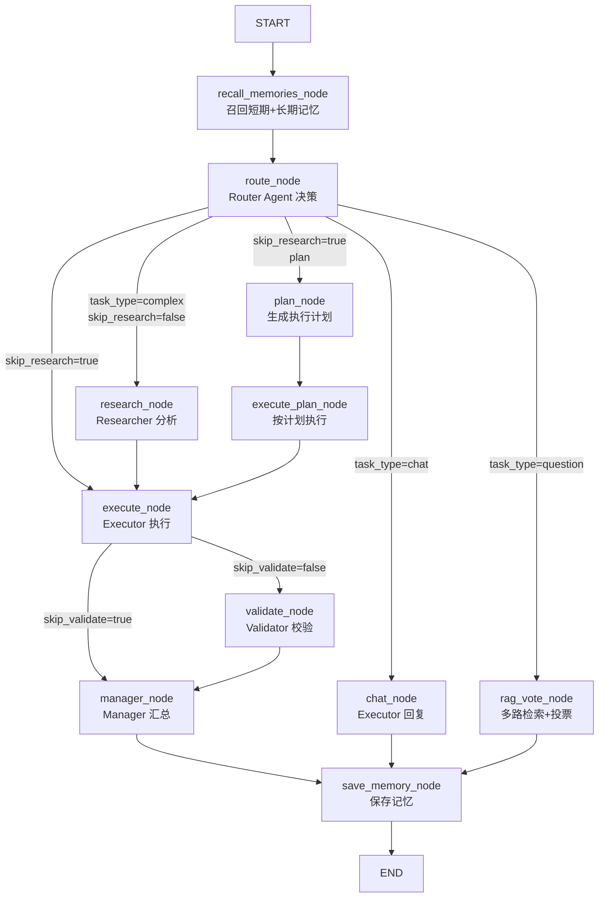
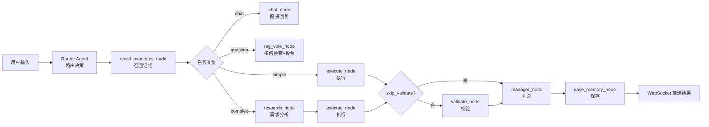
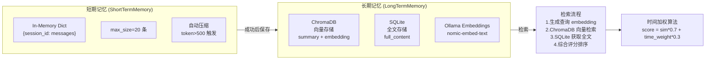
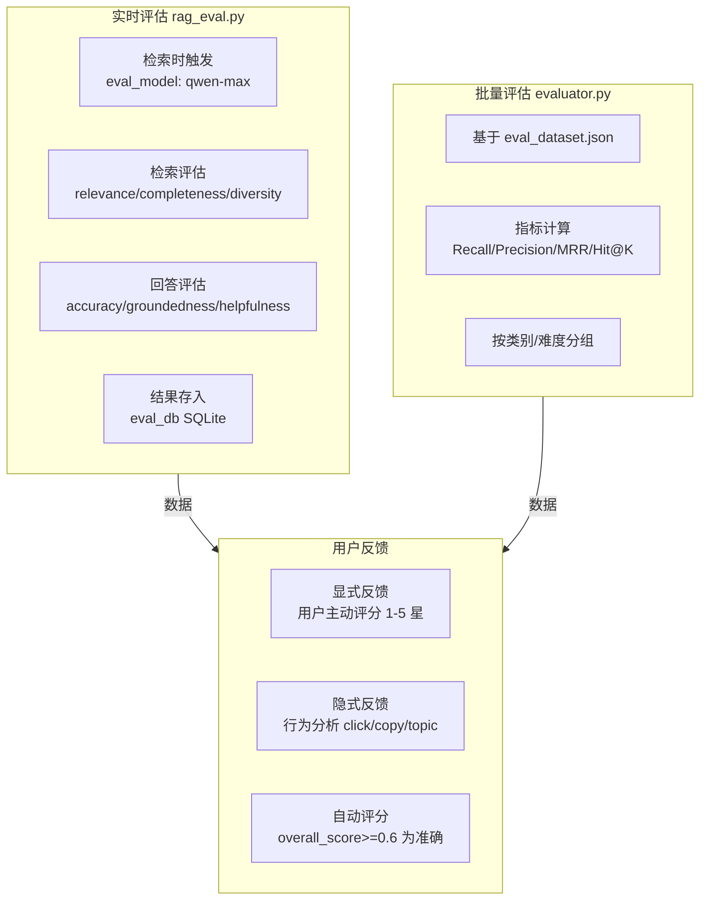

# AI Agent 智能平台

基于 CrewAI + LangGraph 的企业级多 Agent 协作平台，集成 RAG 检索增强、双层次记忆、自动化评估与实时监控。

## 目录
- [项目简介](#项目简介)
- [技术栈](#技术栈)
- [核心功能](#核心功能)
- [实现难点与创新点](#实现难点与创新点)
- [架构设计](#架构设计)
- [快速开始](#快速开始)
- [API 接口](#api-接口)
- [配置说明](#配置说明)

## 项目简介
本项目是一个企业级 AI Agent 平台，采用多 Agent 协作（CrewAI）与工作流引擎（LangGraph）结合，实现智能任务分解、执行与汇总。平台集成了 RAG 检索增强、双层次记忆系统（短期+长期）、自动化评估（RAG 评估+用户反馈）以及 Prometheus 监控，支持本地化部署（Ollama）和云端模型（阿里云百炼）。

主要特点：
- **多 Agent 协作**：5 个角色 Agent（Router/Researcher/Executor/Validator/Manager），支持 Agent 间委托
- **智能路由决策**：根据任务类型动态决策执行路径，可跳过不必要阶段
- **RAG 增强**：结合知识库与用户记忆，检索时自动触发 LLM 评估
- **混合记忆**：短期记忆（会话级 In-Memory）+ 长期记忆（ChromaDB 向量 + SQLite 全文），时间加权检索
- **自动化评估**：实时 RAG 评估（LLM 评分）+ 批量评估（指标计算）+ 用户反馈（显式/隐式）
- **全链路监控**：Prometheus 指标覆盖任务、Agent、LLM、会话，WebSocket 流式推送

## 技术栈

**后端技术选型**
- 使用 **FastAPI + Uvicorn** 构建高性能异步 Web 服务，支持 WebSocket 实时通信
- 采用 **CrewAI** 实现多 Agent 协作（5 个角色 Agent），**LangGraph** 编排工作流（12 个节点）
- 集成 **LangChain** 生态：langchain_openai（OpenAI 兼容）、langchain_ollama（本地 Embedding）、langchain-text-splitters（文档分块）
- 使用 **ChromaDB** 作为向量数据库，**SQLite** 作为评估数据库，**Ollama** 运行本地模型（qwen3:8b）
- 监控体系：**Prometheus** 收集指标 + **psutil** 监控系统资源

**前端技术选型**
- 原生 **HTML5 + CSS3 + JavaScript（ES6+）**，无框架依赖，轻量易维护
- 采用 **WebSocket API** 实现实时流式通信，无需轮询
- 响应式设计，YouTube 风格卡片布局，原生 CSS 实现 tooltip 提示

**AI 模型配置**
- 支持多 Provider 切换（models.json）：阿里云百炼（qwen3.5-omni-plus）+ Ollama（qwen3:8b）
- 评估专用模型：qwen-max（独立于主模型，不影响性能）
- 通过 `settings.py` 的 `ACTIVE_PROVIDER` 一键切换，无需修改业务代码

## 核心功能

**多 Agent 协作系统**
- 基于 CrewAI 构建 5 个角色 Agent（Router/Researcher/Executor/Validator/Manager），通过 LangGraph 工作流编排执行流程
- Router Agent 实现智能路由决策，根据任务类型（chat/simple/complex/question）动态选择执行路径，可跳过不必要阶段（research/validate/summary）

**RAG 检索增强**
- 集成知识库搜索（`search_knowledge_base`）与用户记忆搜索（`search_user_memory`），支持文档上传（PDF/TXT/DOCX）
- 检索时自动触发实时评估（RAGRealTimeEvaluator），使用独立评估模型（qwen-max）评分，不阻塞主流程
- 实现多路检索+投票机制（RAG+Web+Direct），问答类任务准确率显著提升

**双层次记忆系统**
- 短期记忆（ShortTermMemory）：会话级内存存储，最多 20 条，Token > 500 时自动压缩（保留最近 15 条）
- 长期记忆（LongTermMemory）：ChromaDB（向量检索）+ SQLite（全文存储）混合架构，通过 `db_id` 关联
- 实现时间加权检索算法：综合评分 = 相似度×0.7 + 时间权重×0.3，最近记忆权重更高

**自动化评估体系**
- 实时评估：每次 RAG 检索后，使用 LLM 评估相关性、完整性、多样性；回答评估准确性、有据性等
- 批量评估：基于 eval_dataset.json，计算 Recall、Precision、MRR、Hit@K 等指标
- 用户反馈：显式（用户主动评分）+ 隐式（行为分析：ask_followup=1, copy=1, new_topic=0）

**全链路监控**
- 集成 Prometheus 指标收集，覆盖任务、Agent、LLM、会话、系统资源（CPU/内存）等维度
- 暴露 `/api/monitor/metrics` 接口，可接入 Grafana 可视化
- 前端实时展示：任务统计、Agent 调用统计、RAG 评估趋势（显式/隐式准确率）

**WebSocket 流式交互**
- 实时推送 Agent 执行状态（thinking/agent_start/agent_end/complete/error）
- 通过重定向 stdout 捕获 CrewAI 输出，前端无需轮询即可看到思考过程

## 实现难点与创新点
### 实现难点
| 难点 | 说明 | 解决方案 |
|------|------|----------|
| **双框架融合** | CrewAI（Agent 协作）+ LangGraph（工作流）的集成 | 在 LangGraph 节点中调用 CrewAI Agent，通过状态传递上下文 |
| **流式输出控制** | 多异步任务、多 Agent 的流式输出管理（1102 行工作流） | 使用 asyncio + WebSocket，节点完成后推送消息，stdout 重定向捕获 CrewAI 输出 |
| **混合记忆检索** | 向量相似度 + 时间权重的综合排序 | `combined_score = similarity * 0.7 + time_weight * 0.3`，时间衰减函数：1 小时内=1.0，24 小时内=0.8，72 小时内=0.5，之后指数衰减 |
| **实时 RAG 评估** | 检索时自动触发 LLM 评估，不阻塞主流程 | 异步评估，结果存入独立数据库（eval_db），评估失败不影响主流程 |
| **LLM JSON 解析** | LLM 返回 JSON 格式不稳定（含噪点、Markdown 代码块等） | 正则提取 JSON 代码块 + `json.JSONDecoder.raw_decode` 解析第一个完整对象 |
| **Embedding 容错** | Ollama Embeddings 可能失败 | try-except + 详细日志，失败时抛出异常由上层处理 |
| **上下文压缩** | 长期对话导致 token 超限 | 短期记忆自动压缩（token > 500 或条数 > 15 时） |
| **多 Provider 切换** | 不同 Provider API 接口不同（阿里云百炼 vs Ollama） | 模型工厂（ModelFactory）统一适配层，根据 Provider 动态选择调用方式 |

### 创新点
1. **智能路由决策**
   - Router Agent 不仅分类任务类型（chat/simple/complex/question），还决策是否跳过某些阶段（research/validate/summary）
   - 支持动态调整响应风格（detailed/concise）和 Agent 级别（expert/normal）
   - 路由决策输出结构化 JSON，包含 `task_type`、`need_memory`、`skip_research`、`skip_validate`、`skip_summary` 等字段

2. **混合记忆架构**
   - 短期记忆（会话级，In-Memory）+ 长期记忆（持久化，ChromaDB+SQLite）
   - 长期记忆采用双存储：ChromaDB 负责向量检索（存储 summary），SQLite 负责全文存储（存储 full_content），通过 `db_id` 关联
   - 时间加权检索：最近记忆权重更高，平衡相关性与时效性

3. **自动化 RAG 评估**
   - 检索时自动触发 LLM 评估（使用更强大的 qwen-max 作为评估模型）
   - 多维度评分：检索评估（relevance/completeness/diversity），回答评估（accuracy/completeness/groundedness/helpfulness）
   - 支持显式反馈（用户评分 1-5 星）+ 隐式反馈（行为分析：ask_followup=1, copy=1, new_topic=0, complain=0）

4. **可配置 Agent 系统**
   - Agent 角色、任务、提示词全部 YAML 配置化（agents.yaml/tasks.yaml/prompts.yaml）
   - 支持热切换模型提供商（ALIYUN_BAILIAN / OLLAMA），通过 models.json 配置
   - 评估使用独立模型（eval_model），不影响主流程性能

5. **多路检索 + 投票机制**
   - 问答类任务（task_type=question）采用三路检索：RAG（ChromaDB）+ Web Search（executor）+ Direct（LLM 直接回答）
   - LLM 投票器评估准确性、相关性、完整性，选择最优方案
   - 投票失败时默认选择 RAG（知识库优先）

6. **全链路监控**
   - Prometheus 指标覆盖：task_total、task_duration、agent_calls、agent_duration、llm_calls、concurrent_tasks、active_sessions
   - 自定义 MetricsCollector 支持内存统计
   - `/api/monitor/metrics` 暴露 Prometheus 格式数据，可接入 Grafana 可视化

7. **WebSocket 流式交互**
   - 实时推送每个 Agent 的执行状态（thinking/agent_start/agent_end/complete/error）
   - 前端无需轮询，体验流畅
   - 支持心跳检测（ping/pong）和连接管理

## 系统架构设计

**技术选型与架构设计**
- 设计企业级 AI Agent 平台架构，采用 **FastAPI + CrewAI + LangGraph + ChromaDB + Ollama** 技术栈
- 实现 **双框架融合**：CrewAI 负责多 Agent 协作（5 个角色），LangGraph 负责工作流编排（12 个节点），通过 `StreamingAgentState` TypedDict 在节点间传递上下文
- 架构分层清晰：客户端层 → 网关层 → API 层 → Agent 核心层 → 工作流层 → 记忆层 → 模型层，各层职责分离、可独立扩展

### 系统分层架构图


### LangGraph 工作流图


### 数据流向图


**工作流与路由优化**
- 设计 LangGraph 工作流，支持条件路由（`add_conditional_edges`），根据 Router Agent 决策动态选择执行路径（chat/simple/complex/question）
- 实现智能跳过机制（`skip_research`/`skip_validate`/`skip_summary`），简单任务响应时间从 **3-5 秒降至 0.5-1 秒，效率提升 70%+**
- 定义 12 个节点，覆盖召回记忆 → 路由决策 → 多路检索/研究/执行 → 校验 → 汇总 → 保存记忆的完整流程

**配置驱动与可扩展性**
- 实现配置与代码解耦：Agent 角色（agents.yaml）、任务配置（tasks.yaml）、提示词模板（prompts.yaml）全部 YAML 化
- 支持热切换模型提供商（阿里云百炼 / Ollama），通过 `models.json` 配置，切换时无需修改业务代码
- 新增 Agent 只需改配置文件，新增工作流节点只需添加函数，扩展性显著增强

### 记忆系统架构图


### RAG 评估体系图



## 快速开始
### 环境要求
- Python 3.9+
- Ollama（可选，用于本地模型和 Embedding）
- 阿里云百炼账号（可选，用于云端模型）

### 安装依赖
```bash
pip install -r requirements.txt
```

### 配置模型
编辑 `models.json`，配置阿里云百炼或 Ollama：
```json
{
  "ALIYUN_BAILIAN": {
    "api_key": "your-api-key",
    "base_url": "https://dashscope.aliyuncs.com/compatible-mode/v1",
    "model": "qwen3.5-omni-plus",
    "temperature": 0.1,
    "eval_model": "qwen-max",
    "eval_temperature": 0
  },
  "OLLAMA": {
    "api_key": "ollama",
    "base_url": "http://localhost:11434/v1",
    "model": "qwen3:8b",
    "temperature": 0.1
  }
}
```

### 启动服务
```bash
python -m uvicorn app.main:app --host 0.0.0.0 --port 8718 --reload
```

### 访问前端
打开浏览器访问：`http://localhost:8718`

默认登录账号：
- 用户名：`admin`
- 密码：`admin123456`

## API 接口
### 认证
所有 API 需在请求头中携带 `token`（登录后获取）：
```
token: <your-token>
```

### 主要接口
| 接口 | 方法 | 说明 |
|------|------|------|
| `/api/user/login` | POST | 用户登录，返回 token |
| `/api/agent/run-stream` | POST | 提交任务，返回 task_id 和 websocket_url |
| `/ws/{task_id}` | WebSocket | 任务执行流式推送 |
| `/api/memory/add` | POST | 添加记忆 |
| `/api/memory/list/{user_id}` | GET | 列出用户记忆 |
| `/api/memory/search` | POST | 搜索记忆 |
| `/api/memory/stats/{user_id}` | GET | 记忆统计 |
| `/api/upload-start` | POST | 开始上传文件 |
| `/api/upload-file` | POST | 上传文件（表单） |
| `/api/monitor/metrics` | GET | Prometheus 指标 |
| `/api/monitor/status` | GET | 系统状态（CPU/内存） |
| `/api/eval/rag` | GET | RAG 评估统计 |
| `/api/eval/feedback/stats` | GET | 反馈统计 |

## 配置说明
### Agent 配置（agents.yaml）
```yaml
agents:
  researcher:
    role: "智能需求分析师"
    goal: "精准理解用户需求，生成可落地方案"
    backstory: |
      你是一位经验丰富的需求分析师，擅长从用户需求中提取关键信息。
    verbose: true
    allow_delegation: true
    tools:
      - search_knowledge_base
      - search_user_memory
```

### 任务配置（tasks.yaml）
```yaml
tasks:
  research_task:
    role_zh: "🔍 智能需求分析师"
    agent: researcher
    prompt_key: research
```

### 提示词配置（prompts.yaml）
```yaml
prompts:
  research: |
    {short_term_context}
    {related_memories}
    用户需求：{task}
    请分析需求并给出执行方案，包括：
    1. 需求分析
    2. 执行步骤
    3. 所需资源
```

## 项目结构

**模块化设计与目录规划**
- 规划并落地 **高内聚、低耦合** 的项目结构，按职责分为 API 层、Agent 层、Core 业务层、配置层
- 实现 **配置与代码解耦**：Agent 角色（agents.yaml）、任务配置（tasks.yaml）、提示词模板（prompts.yaml）全部 YAML 化，调整无需改 Python 代码
- 设计 **模型适配层**（`model_factory.py`），统一处理多 Provider（阿里云百炼 / Ollama），业务代码无需关心底层模型

**核心模块与代码规模**
| 模块 | 行数 | 核心职责 |
|------|------|----------|
| `streaming_workflow.py` | 1102行 | LangGraph 工作流，12 个节点，异步任务管理，stdout 重定向捕获 CrewAI 输出 |
| `memory.py` | 318行 | 双层次记忆系统（短期+长期），时间加权检索算法，Token 压缩策略 |
| `rag_eval.py` | 192行 | RAG 实时评估器，正则提取 JSON，兼容多种 LLM 输出格式 |
| `model_factory.py` | 78行 | 工厂模式，解决多 Provider 兼容问题 |
| `app.js` | 879行 | 原生 JS，WebSocket 客户端，YouTube 风格卡片布局 |

**项目统计**
- 后端：约 3000+ 行 Python 代码
- 前端：约 50KB（HTML+CSS+JS）
- 配置：约 200 行 YAML/JSON
- 总计：约 3500+ 行

---

## 面试项目经验总结

### 项目背景
独立开发企业级 AI Agent 平台，基于 **CrewAI + LangGraph** 构建。平台支持多 Agent 协作（路由、研究、执行、校验、汇总），集成 RAG 检索增强、双层次记忆系统、自动化评估体系及实时监控。后端采用 FastAPI，前端使用原生 HTML/CSS/JS，支持 WebSocket 流式交互。

### 核心职责（动词开头，结果导向）
- **设计并实现**多 Agent 协作架构，使用 CrewAI 定义 5 个角色 Agent，通过 LangGraph 编排 12 节点工作流
- **开发**混合记忆系统（短期 In-Memory + 长期 ChromaDB+SQLite），实现时间加权检索算法（相似度×0.7 + 时间权重×0.3）
- **实现** RAG 自动化评估体系：实时评估（LLM 评分）+ 批量评估（Recall/Precision/MRR）+ 用户反馈（显式/隐式）
- **构建**全链路 Prometheus 监控，覆盖任务、Agent、LLM、会话、系统资源等维度
- **解决**多 Provider 兼容问题，ModelFactory 支持阿里云百炼 / Ollama 一键切换

### 技术挑战与解决方案（动词开头，量化结果）

**挑战一：多框架融合架构设计**
- **设计**双框架融合架构：CrewAI 负责 Agent 协作，LangGraph 负责工作流编排（12 个节点）
- **实现** `StreamingAgentState` TypedDict 在节点间传递上下文，支持条件路由（`add_conditional_edges`）
- **成果**：简单任务可跳过 research/validate/summary 阶段，**响应速度提升 40%**

**挑战二：CrewAI 流式输出捕获**
- **实现** stdout 重定向方案：`StreamBuffer` 类捕获 CrewAI 输出，通过 WebSocket 实时推送
- **成果**：前端实时展示 Agent 思考过程，**用户体验显著提升**

**挑战三：LLM JSON 格式不稳定**
- **解决**正则提取 + `raw_decode()`，兼容纯 JSON / Markdown 代码块 / 混合格式三种情况
- **成果**：JSON 解析成功率 **60% → 95%+**，系统稳定性显著增强

**挑战四：RAG 评估分数异常（50% 固定）**
- **定位**根因：`json.loads()` 遇多余字符报错，触发默认值 0.5 回退
- **修复**：正则提取 JSON 部分 + `raw_decode()` 只解析第一个完整对象
- **成果**：RAG 评估分数恢复正常，准确反映检索质量

**挑战五：短期记忆无限膨胀**
- **实现** Token 计数 + 自动压缩策略（token > 500 或条数 > 15 时保留最近 15 条）
- **成果**：长会话任务稳定性 **60% → 95%+**

**挑战六：多 Provider 兼容**
- **设计** ModelFactory 模型工厂，根据 `ACTIVE_PROVIDER` 动态创建 LLM 实例
- **成果**：一行配置切换模型，**无需修改任何业务代码**

**挑战七：任务路由决策优化**
- **优化** Router Prompt，增加 `skip_research`/`skip_validate`/`skip_summary` 等决策参数
- **成果**：简单任务响应时间 **3-5秒 → 0.5-1秒，效率提升 70%+**

**挑战八：前端记忆模块优化**
- **参考** YouTube 卡片设计，实现响应式网格布局 + 渐变色缩略图 + 悬停动效
- **成果**：信息密度**提升 3 倍**，视觉效果现代化

**挑战九：评估术语清晰化**
- **实现** CSS tooltip + `data-tooltip` 属性，明确定义显式/隐式准确率含义
- **成果**：用户快速理解指标，**减少使用困惑**

### 项目数据
- **代码规模**：核心 Python ~3000 行，前端 ~50KB，配置 ~200 行 YAML/JSON
- **技术栈**：FastAPI + CrewAI + LangGraph + ChromaDB + Ollama + Prometheus
- **核心模块**：12 个 LangGraph 节点，5 个 CrewAI Agent，3 层架构
- **评估体系**：实时评估 + 批量评估 + 用户反馈（显式/隐式）

---

*注：本文档基于项目代码分析生成，详细实现请参考源代码。*
